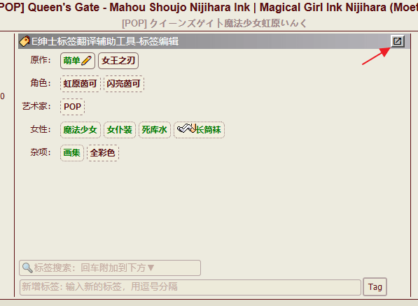
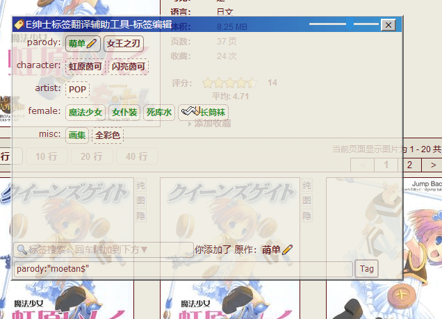
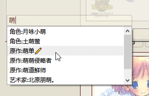
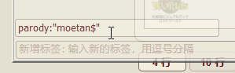
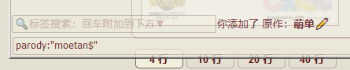
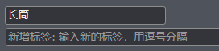
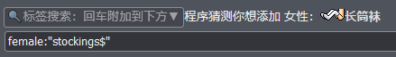
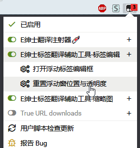
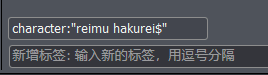
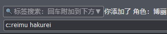

标签编辑工具
=========
可将标签区域浮动和半透明，方便查阅底部图片的同时添加标签。  

<!-- 配合[[E绅士翻译注射器(EhTagSyringe)|EhTagSyringe]]（v1.3.8以上）使用时，还可以搜索多个标签后一次性提交。   -->
[安装脚本](//sleazyfork.org/scripts/381766)

默认情况下并不会浮动，点击浮动按钮即可开启浮动窗口  

标题栏内的滑柄可以控制浮动窗体透明度。  

### 以下功能需配合 [EhSyringe](../../../../EhSyringe)扩展 或 [E绅士翻译注射器(EhTagSyringe)](//sleazyfork.org/zh-CN/scripts/33136-ehtagsyringe)脚本 使用
原始的标签输入框一次只能搜索一个标签，每次都要等待新增标签提交成功后才能搜索下一个标签，比较花时间。  
可以在本工具添加的搜索框内进行搜索添加到原始输入框，方便一次提交多个标签。
1. 输入文字搜索标签，点击对应标签，会得到标签值  

1. 按回车可将该标签增加到原始输入框，并会给出该标签提示。  

1. 搜索标签并回车将会自动附加到原始输入框，最后手动点击一次“Tag”按钮即可提交所有标签。  
  
1. 不支持搜索翻译数据库内不存在的标签，需要添加未收录标签请直接在原始输入框输入。

## 更新日志
v1.2.0版本的新功能：
* 支持简单猜测中文
  1. 输入含有的中文  

  1. 回车后会自动填入第一个包含输入文字的标签  

* 支持记录窗体位置与透明度，如果窗体因为特殊情况消失不见了，可以从菜单重置窗体。  

v1.3.0版本的新功能：
* 自动缩短标签命名空间，以最短形式插入。由于原始标签输入框限定一次最多提交200字符，因此使用短名可以一次提交更多标签。  

* 当标签搜索框为空时按下回车，会自动提交原始标签输入框。

v1.4.0更新内容：
* 增加对 EhSyringe 扩展的支持