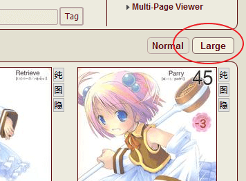
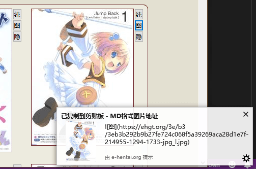

缩略图工具
=========
自动将 E 绅士大缩略图域名改为手机站域名，并可以一键复制各站点格式的缩略图。

去到处找能在 E 站看的图还是很困难的一件工作，此脚本工具可以快速将E站作品缩略图复制为 Wiki 使用的格式。  
[安装脚本](//sleazyfork.org/scripts/31743)

画廊内点击 `Large` 开启**大图模式**  

点击按钮自动将对应的站点格式复制到剪贴板。（里站、表站、手机版）  
* 点击“纯”，即可直接复制得 `图片网址`  
获得单纯图片网址
* 点击“图”，即可直接复制得 ``  
获得MD图片格式
* 点击“隐”，即可直接复制得 ``  
获得隐藏的MD图片格式
* 点击“限”，即可直接复制得 ``  
获得R18G限制级的MD图片格式

