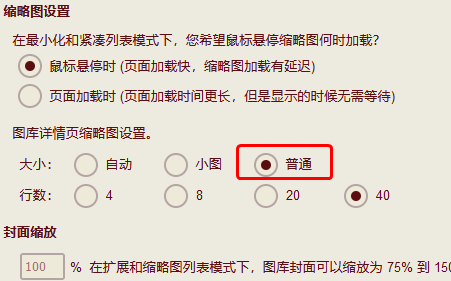
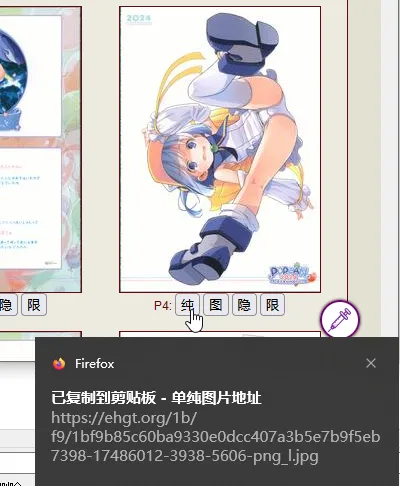

缩略图工具
=========
自动将 E 绅士大缩略图域名改为手机站域名，并可以一键复制各站点格式的缩略图。

去到处找能在 E 站看的图还是很困难的一件工作，此脚本工具可以快速将E站作品缩略图复制为 Wiki 使用的格式。  
[安装脚本](//sleazyfork.org/scripts/31743)

在账号设置内设置缩略图大小为普通，以开启**独立图片**模式  

点击按钮自动将对应的站点格式复制到剪贴板。（里站、表站、手机版）

| 按钮名 | 格式 | 解释 |
| ----- | ---- | ---- |
| **纯** | `图片网址` | 单纯图片网址 |
| **图** | `` | MarkDown 格式图片格式 |
| **隐** | `` | 隐藏的 MarkDown 格式图片格式   |
| **限** | `` | R18G 限制级的 MarkDown 格式图片格式   |

